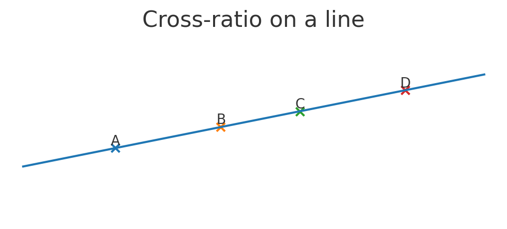
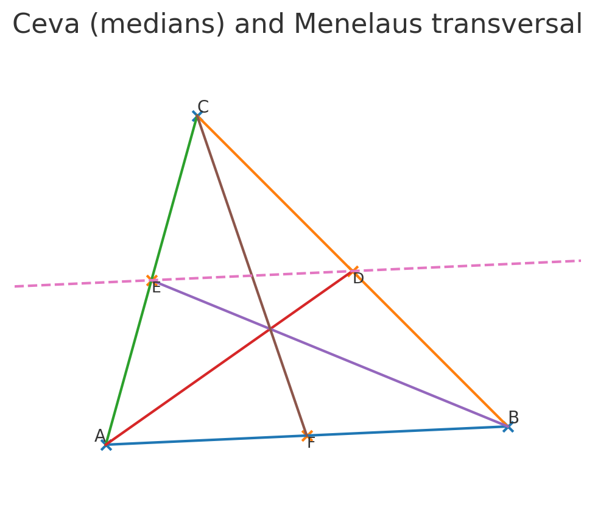
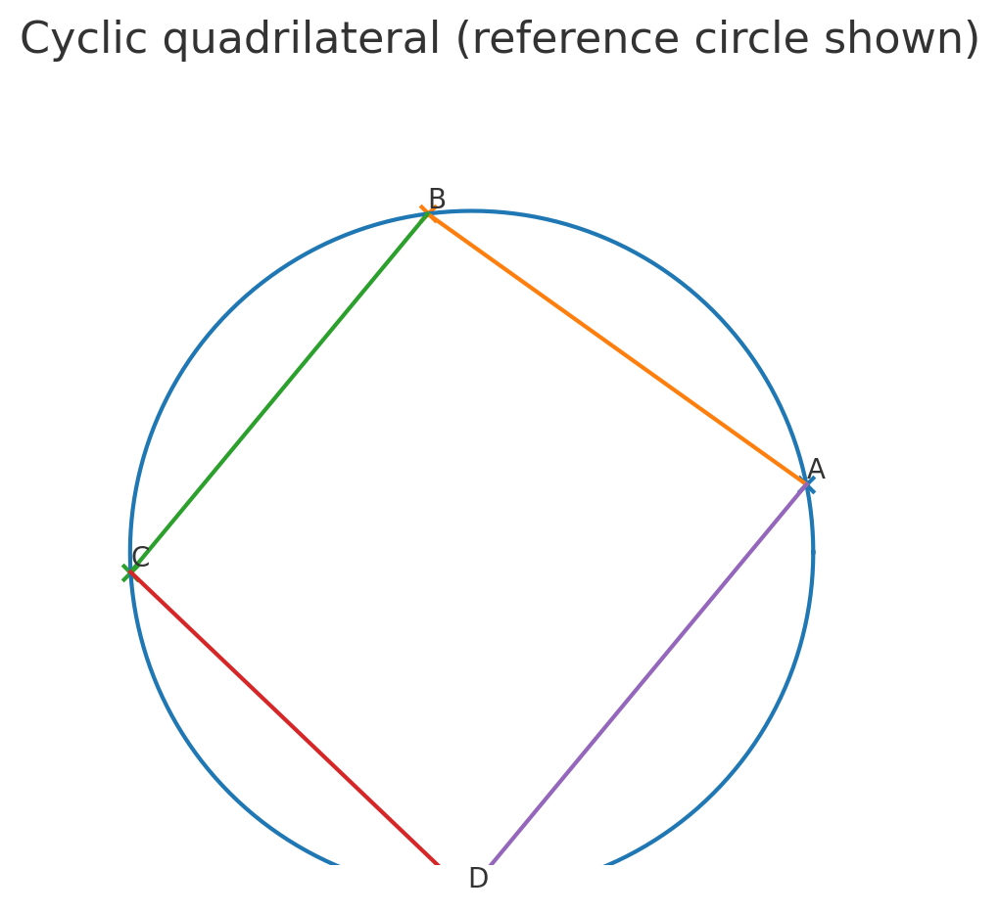
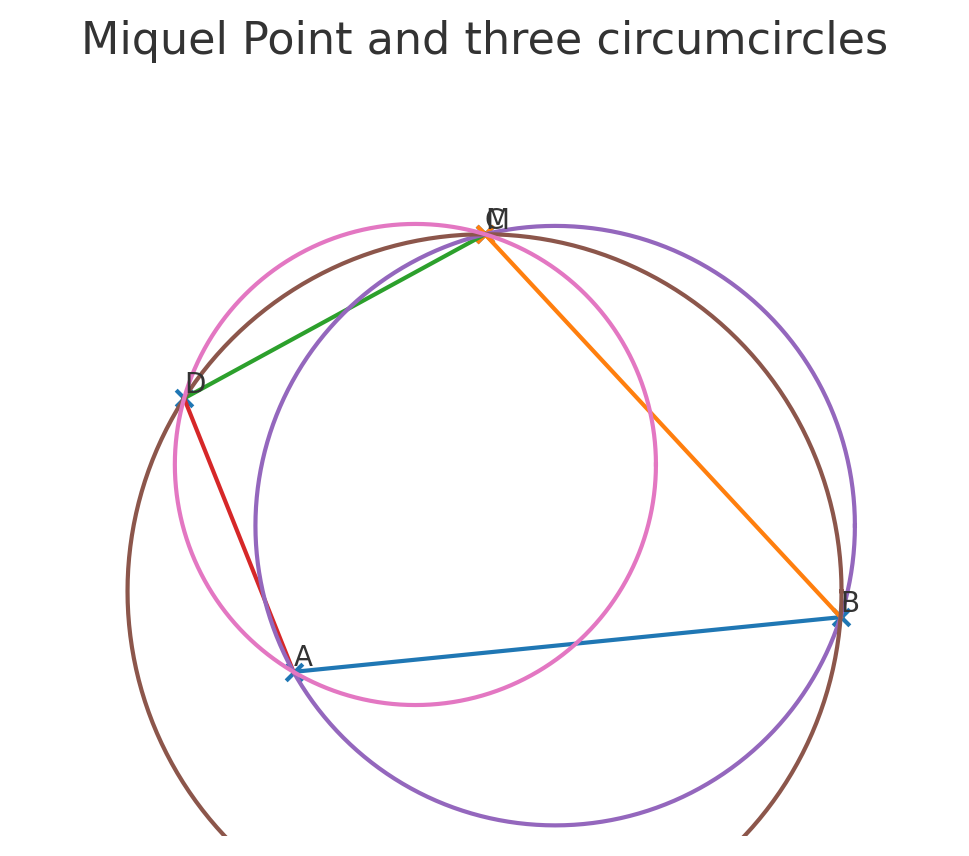
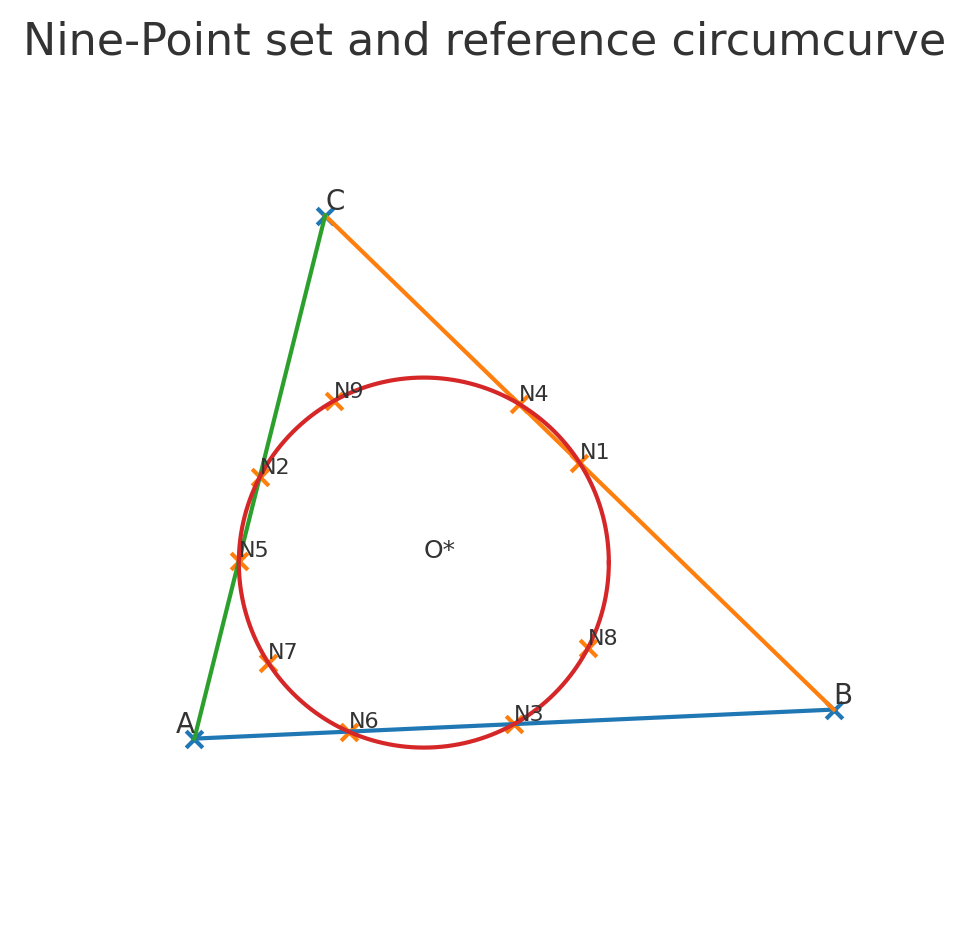

# adaptive-pi-geometry


A lightweight Python library + reference spec for **Adaptive \u03c0 (\u03c0\u2090)** geometry: a unifying framework that reduces to Euclidean geometry when curvature \u2192 0 and extends gracefully to curved/inhomogeneous settings using first\u2011order Gauss\u2013Bonnet corrections.

---

## Why this repo exists

* **Goal:** Provide clean, testable primitives for \u03c0\u2090 so others can *use* and *verify* the framework on classic Euclidean (IMO-style) problems, then turn the \u201ccurvature dial\u201d to see controlled deviations.
* **Philosophy:** Everything here must (1) recover standard Euclidean results when `K(x,y) = 0`, and (2) make curvature effects explicit and composable.

---

## Repository structure

```
adaptive-pi-geometry/
├─ README.md
├─ LICENSE
├─ pyproject.toml
├─ .gitignore
├─ docs/
│  ├─ SPEC.md
│  └─ IMO-translation-guide.md
├─ src/
│  └─ pi_a/
│     ├─ __init__.py
│     ├─ core.py            # \u03c0\u2090 primitives: angle sum, cyclicity, flux integrals
│     ├─ geometry.py        # basic constructions & helpers
│     └─ models.py          # curvature fields (K) + convenience wrappers
├─ examples/
│  ├─ example1_orthocenter_reflection_pi_a.py
│  └─ example2_ceva_trig_pia.py
└─ tests/
   ├─ test_flat_limit.py
   ├─ test_cyclicity_balance.py
   └─ test_ceva_trig_pia.py
```

---

## Installation and Running

1. **Clone and enter the repo**

   ```bash
   git clone <repo-url>
   cd adaptive-pi-geometry
   ```

2. **Create & activate a virtual environment**

   ```bash
   python -m venv .venv
   source .venv/bin/activate  # Windows: .venv\Scripts\activate
   ```

3. **Install and test**

   ```bash
   pip install -e .
   pytest -q
   ```

4. **Run an example**

   ```bash
   python examples/example1_orthocenter_reflection_pi_a.py
   ```

```python
# Minimal usage
from pi_a.core import triangle_angle_sum_pia, is_pia_cyclic
from pi_a.models import ConstantCurvature

A, B, C = (0.0, 0.0), (1.0, 0.0), (0.2, 0.8)
K = ConstantCurvature(0.0)   # Flat: \u03c0\u2090 \u2192 \u03c0
S = triangle_angle_sum_pia(A,B,C, K)
print(S)  # ~ math.pi

# Check \u03c0\u2090-cyclicity for quadruple (recovers Euclidean cyclic test when K=0)
D = (0.9, 0.2)
print(is_pia_cyclic(A,B,C,D, K))
```

---

## Design guarantees

* **Flat\u2011limit exactness:** With `K(x,y) \u2261 0`, all \u03c0\u2090 primitives reduce to classical Euclidean identities.
* **First\u2011order correctness:** For small/slowly\u2011varying curvature, results match Gauss\u2013Bonnet style corrections with integrated curvature flux through polygons/sectors.
* **Composability:** Angle sums, cyclicity, Ceva/Menelaus (trig form) expose the curvature terms explicitly so you can budget/trace deviations.

---

## Figures

Preview of solved configurations generated by example scripts.

| Figure | Preview |
| --- | --- |
| Cross-ratio | <a href="cross_ratio.png"></a> |
| Ceva & Menelaus | <a href="ceva_menelaus.png"></a> |
| Cyclic quadrilateral | <a href="cyclic_quad.png"></a> |
| Miquel point | <a href="miquel.png"></a> |
| Nine-point circle | <a href="ninepoint.png"></a> |

---

## Solved Implementation Pack

A full walkthrough of the scripts that produce these figures now lives in
[docs/SOLVED_IMPLEMENTATION_PACK.md](docs/SOLVED_IMPLEMENTATION_PACK.md).

---

## Files

... (See individual files for details).

---

## Roadmap

* **v0.2**: Explicit \u03c0\u2090 Ceva/Menelaus numerics (build sector/flux terms for split points).
* **v0.3**: Inversion and power\u2011of\u2011a\u2011point under \u03c0\u2090; adaptive circumcurves.
* **v0.4**: Geodesic circle model & better sector integration (adaptive radius profile).
* **v0.5**: Symbolic layer (SymPy) for first\u2011order expansions and human\u2011readable proofs.

---

Open Problems (IMO-flavored, Adaptive π)

We propose collecting geometry problems that are classically solved in Euclidean space but remain open or only partially understood under πₐ corrections:

Trig-Ceva ⇔ Trig-Menelaus DualityVerify whether the exponential flux correction factor preserves the equivalence between Ceva concurrency and Menelaus collinearity.

Miquel Point StabilityFor a quadrilateral, the Miquel point lies on all four circle intersections. Does a πₐ-perturbed version exist with bounded first-order drift?

Nine-Point Circle GeneralizationDefine an adaptive π nine-point curve. Where is its center located under curvature fields? Is it close to Euler line in first order?

Projective Cross-Ratio DriftQuantify how cross-ratios of four collinear points deform under πₐ corrections. Can we prove bounded distortion?

Cyclic Quadrilateral AnglesClassical: opposite angles sum to 180°. Adaptive π: do they sum to πₐ + O(K)? How uniform is the correction across fields?
