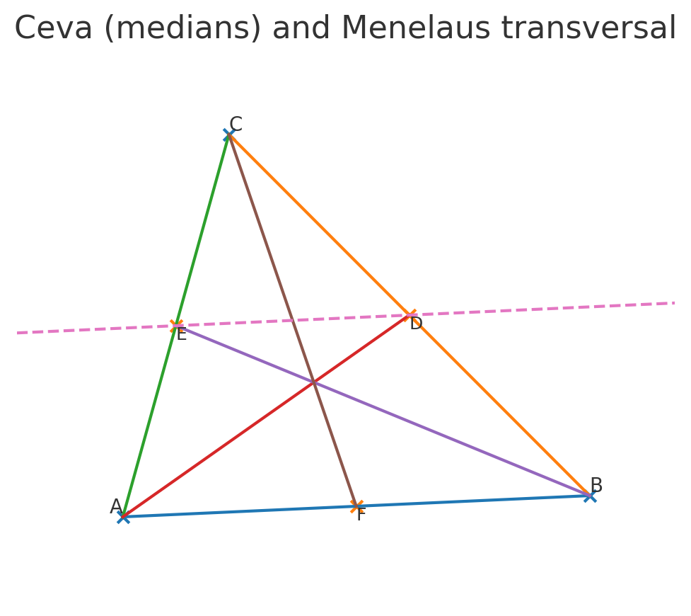

# Solved Implementation Pack

This document collects the example scripts and resulting figures showcasing the Adaptive π geometry primitives.

## Cross-ratio

## Ceva vs. Menelaus

## Cyclic quadrilateral angles

## Miquel point

## Nine-point circle

Each figure corresponds to a small script under `examples/` or forthcoming demos.
